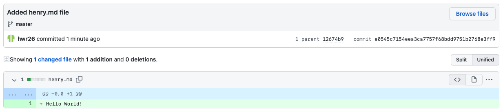
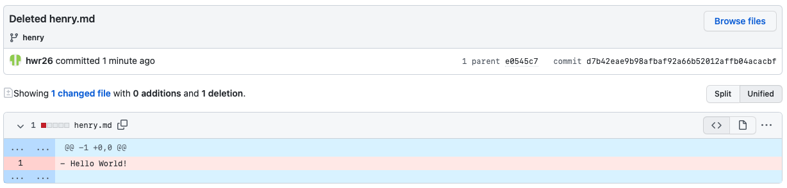

# Git Tutorial

To begin, let's answer the question: what is Git? Git is a version control
system. It allows many users to contribute to and edit a single code base.
There are many resources to learn more about this software such as the
excellent tutorials [here](https://www.atlassian.com/git/tutorials). However,
this document serves as a quick introduction tailored to get you developing on
this repo as quickly as possible. It is recommended to follow along with the
example to get you comfortable with the process. If you have any questions or
get stuck, don't hesitate to reach out (hwr26)!

## Structure

First, let's understand high level structure. A Git repository is a "virtual
storage of your project". It maintains all the versions of the code. The
repository hosted on GitHub is called a "remote repository". After `git clone`
(see later in the tutorial), you will have a clone of the repository on your
machine referred to as the "local repository". The final piece is the hardest
piece to wrap your head around (in my opinion). A repository is fundamentally
different from a directory of files. The actual directory of files on your
machine is called the "workspace". The rest of the tutorial will explain how
these three pieces (remote repo, local repo, and workspace) interact with each
other.

## Cloning

To clone the remote repo from GitHub on to your local machine, run the
following commands. The final line is specific to this project and configures
Git to filter out Jupyter Notebook output and metadata. This makes version
control of Jupyter Notebooks more pleasant.

```
git clone git@github.com:engri-1101/textbook.git
cd engri-1101-labs
git config --local include.path ../.gitconfig
```

Running the `git status` command should return the following.

```
$ git status
On branch master
Your branch is up to date with 'origin/master'.
```

## Making a Change

As a running example, add a file called `<your_name>.md` to the repo with the
classic text `Hello World!`. Now run `git status` again.

```
$ git status
On branch master
Your branch is up to date with 'origin/master'.

Untracked files:
  (use "git add <file>..." to include in what will be committed)
	henry.md

nothing added to commit but untracked files present (use "git add" to track)
```

Currently, you have made a change to the workspace. However, this change is not
registered in your local repo yet. To do that, you will need to "commit" the
change. Afterwards you'll be able to "push" your change to the remote repo.
Before committing, you must choose which changes you want to commit in a process
called "staging". Your current change is "unstaged". To stage it, run `git add
.` which stages all changes or run `git add <your_name>.md` to only stage that
file. Afterwards, if you run `git status`, you should see the file is staged.

```
$ git status
On branch master
Your branch is up to date with 'origin/master'.

Changes to be committed:
  (use "git restore --staged <file>..." to unstage)
	new file:   henry.md
```

Now, let's commit the change. The "commit message" can be added in two ways:
via the `-m` tag or by opening a text editor in your terminal emulator (this
happens by default if you don't supply the `-m` tag). Let's look at the first
way.

```
$ git commit -m "Added henry.md file"
"Added henry.md file"
[master e0545c7] Added henry.md file
 1 file changed, 1 insertion(+)
 create mode 100644 henry.md
```

If you just run `git commit`, your default text editor is probably Nano or Vim.
To save you the trouble with Vim, press `i` to enter insert mode so you can
write your message and then `esc` to exit insert mode. The commit message can
then be saved with `:x` or aborted with `:q!`.

After committing your change, run `git status` again.

```
$ git status
On branch master
Your branch is ahead of 'origin/master' by 1 commit.
  (use "git push" to publish your local commits)
```

Your local repo now has your change registered but this message indicates you
have not pushed it to the remote repo hosted on GitHub yet. Other people can't
see all of your hard work! To do this final step, run `git push` (if that does
not work, run `git push -u origin master` and `git push` will work on the next
go around).

```
$ git push
Enumerating objects: 4, done.
Counting objects: 100% (4/4), done.
Delta compression using up to 12 threads
Compressing objects: 100% (2/2), done.
Writing objects: 100% (3/3), 296 bytes | 296.00 KiB/s, done.
Total 3 (delta 1), reused 0 (delta 0), pack-reused 0
remote: Resolving deltas: 100% (1/1), completed with 1 local object.
To git@github.com:engri-1101/textbook.git
   12674b9..e0545c7  master -> master
```

You have now made a change and pushed it to the remote repo. You can see your
change on GitHub by clicking "commits" under the green "Code" button. Select
your commit by clicking on the commit message. It should look something like
this.



This is sufficient to get started. However, the ideal way to make changes is
through something called branches which we will discuss in the next section.

## Branches (Optional)

You probably noticed the phrase `On branch master` above. In Git, we can
diverge from the `master` branch and commit to another branch that does not
affect `master`. Then, when we are happy with our changes and know it won't
break anything, we can merge our changes back in. Let's go ahead and delete the
file we made in the previous section but use this new technique for making a
change.

First, let's check what branch we are on by running `git branch`. We should be
on `master` and that should be the only branch.

```
$ git branch
* master
```

Now, let's create a new branch called `<your_name>` with the command `git
checkout -b <your_name>`.

```
$ git checkout -b henry
Switched to a new branch 'henry'
```

Run `git branch` again to verify you have switched to that branch.

```
$ git branch
* henry
  master
```

You can now delete the file and stage and commit the changes like before.

```
$ git add .
$ git commit -m "Deleted henry.md"
[henry d7b42ea] Deleted henry.md
 1 file changed, 1 deletion(-)
```

Note that we now have this branch on our local repo with our committed change
but this branch is not on the remote repo yet. We need to push and create the
new branch. This is done with `git push -u origin <your_name>`.

```
$ git push -u origin henry
Enumerating objects: 3, done.
Counting objects: 100% (3/3), done.
Delta compression using up to 12 threads
Compressing objects: 100% (2/2), done.
Writing objects: 100% (2/2), 230 bytes | 230.00 KiB/s, done.
Total 2 (delta 1), reused 0 (delta 0), pack-reused 0
remote: Resolving deltas: 100% (1/1), completed with 1 local object.
remote:
remote: Create a pull request for 'henry' on GitHub by visiting:
remote:      https://github.com/engri-1101/textbook/pull/new/henry
remote:
To git@github.com:engri-1101/textbook.git
 * [new branch]      henry -> henry
Branch 'henry' set up to track remote branch 'henry' from 'origin'.
```

Go back to GitHub. Click on "master" and you should now see your branch in the
drop down. Click on your branch and you should see the commit you made on that
branch.



We are happy with these changes so we want to merge this branch back in to
`master`. To do this, click "Contribute" > "Open Pull Request". At this point,
you could click "Reviewers" and add a reviewer if you want someone to look at
your changes before merging. Once you are satisfied, click "Merge pull request"
and then "Confirm merge". Now that the changes have been merged, we can delete the
branch!

Back in your terminal emulator, run `git checkout master` to return to the
`master` branch.

```
$ git checkout master
Switched to branch 'master'
Your branch is up to date with 'origin/master'.
```

Now, run `git pull` to pull the remote `master` branch which has been merged.

```
$ git pull
remote: Enumerating objects: 1, done.
remote: Counting objects: 100% (1/1), done.
remote: Total 1 (delta 0), reused 0 (delta 0), pack-reused 0
Unpacking objects: 100% (1/1), 264 bytes | 264.00 KiB/s, done.
From github.coecis.cornell.edu:hwr26/engri-1101-labs
   e0545c7..1139a23  master     -> origin/master
Updating e0545c7..1139a23
Fast-forward
 henry.md | 1 -
 1 file changed, 1 deletion(-)
 delete mode 100644 henry.md
```

Similarly, we can now delete the branch locally.

```
$ git branch -d henry
Deleted branch henry (was d7b42ea).
```

Congratulations! You are now ready to make contributions like an expert.
